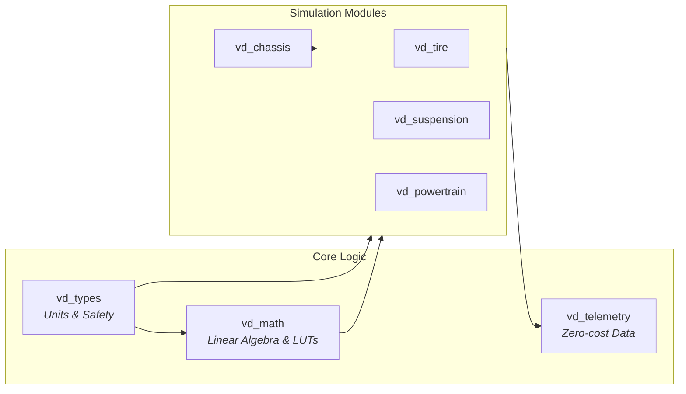

<div align="center">

<br>

# Mu-Sim

**Vehicle Dynamics Simulation Engine**

<br>

*Real-time physics simulation with deterministic behavior,*<br>
*zero runtime allocations, and embedded systems compatibility.*

<br>

<!-- Main Status Badges -->
<p>


</p>

<!-- Tech Stack Badges -->
<p>


</p>

<br>

[Quick Start](#quick-start) • [Architecture](#architecture) • [API Docs](#crates)

<br>

</div>

---

<br>

## ✨ Why Mu-Sim?

<table>
<tr>
<td width="50%" valign="top">

### 🎯 Type-Safe Physics

Compile-time unit checking eliminates the classic *meters vs feet* disasters. Physical quantities carry their units in the type system — wrong conversions simply won't compile.

```rust
let distance = Meters(100.0);
let time = Seconds(10.0);
let velocity = distance / time; // MetersPerSecond
```

</td>
<td width="50%" valign="top">

### ⚡ Real-Time Ready

Designed for deterministic simulation loops at fixed timesteps. No heap allocations in hot paths. Predictable, consistent timing for hardware-in-the-loop testing.

```rust
// Fixed 1kHz physics loop
loop {
    world.step(Seconds(0.001));
}
```

</td>
</tr>
<tr>
<td width="50%" valign="top">

### 📊 High-Performance LUTs

Engine maps, tire curves, aerodynamic tables — all use O(log n) binary search with linear, bilinear, and trilinear interpolation. Cache-friendly, branch-minimized.

```rust
let torque = engine_map.lookup(rpm);
let grip = tire_model.lookup(slip, load);
```

</td>
<td width="50%" valign="top">

### 🔧 Embedded Compatible

Full `no_std` support from day one. Run on desktop simulators during development, deploy to embedded ECUs in production. Same codebase, same behavior.

```rust
#![no_std]
use vd_math::Lut1D;
```

</td>
</tr>
</table>

<br>

## 🏗 Architecture

The engine is built as a modular ecosystem of specialized crates, ensuring strict isolation and fast compilation.



<br>

### 📦 Module Breakdown

**`vd_types`** — Physical Units  
Type-safe SI units using Rust's type system to prevent dimensional errors at compile time.

**`vd_math`** — Linear Algebra & Interpolation  
Wrappers over `nalgebra` and high-performance Lookup Tables (LUTs).

**`vd_telemetry`** — Zero-Cost Telemetry  
A trait-based system that compiles away to nothing when not in use.

<br>

## 📚 Crates

<details>
<summary><b>vd_types</b> — Physical Units</summary>

<br>

Prevent unit confusion at compile time with zero runtime cost.

```rust
use vd_types::{Meters, Seconds, MetersPerSecond, Newtons, Kilograms};

let distance = Meters(100.0);
let time = Seconds(10.0);
let velocity: MetersPerSecond = distance / time;  // Type-checked

let mass = Kilograms(1200.0);
let acceleration = velocity / time;
let force: Newtons = mass * acceleration;         // F = ma, verified by compiler
```

</details>

<details>
<summary><b>vd_math</b> — Linear Algebra & Interpolation</summary>

<br>

Built on `nalgebra` with ergonomic wrappers and high-performance lookup tables.

```rust
use vd_math::{Vec3, Lut1D, Lut2D};

// Vectors and rotations
let velocity = Vec3::new(10.0, 0.0, 0.0);
let gravity = Vec3::new(0.0, 0.0, -9.81);

// Engine torque curve: RPM -> Nm
let engine = Lut1D::new(
    vec![1000.0, 3000.0, 5000.0, 7000.0],
    vec![ 180.0,  320.0,  290.0,  220.0],
)?;
let torque = engine.lookup(4200.0);  // Interpolated

// Tire grip surface: slip_angle x slip_ratio -> mu
let tire = Lut2D::new(slip_angles, slip_ratios, grip_coefficients)?;
let mu = tire.lookup(8.5, 0.12);     // Bilinear interpolation
```

</details>

<details>
<summary><b>vd_telemetry</b> — Zero-Cost Telemetry</summary>

<br>

Feature-gated telemetry that compiles to nothing when disabled.

```rust
use vd_telemetry::{TelemetryProvider, NoOpTelemetry};

fn simulate<T: TelemetryProvider>(telemetry: &mut T) {
    let speed_id = telemetry.register_channel("vehicle.speed", "m/s");
    
    // Hot loop - zero overhead when telemetry disabled
    loop {
        let speed = compute_speed();
        telemetry.log(speed_id, speed);  // Compiles to nothing with NoOpTelemetry
    }
}

// With feature "enable_telemetry":
// use vd_telemetry::MemoryRecorder;
// let mut recorder = MemoryRecorder::with_defaults();
// simulate(&mut recorder);

// Without feature (zero-cost):
let mut noop = NoOpTelemetry;  // ZST: 0 bytes
simulate(&mut noop);
```

</details>

<br>

## 🚀 Quick Start

```bash
# Clone
git clone https://github.com/user/mu-sim && cd mu-sim

# Build
cargo build --release

# Test
cargo test --all

# Lint
cargo clippy --all
```

---

<div align="center">

<br>

**Built for precision. Engineered for speed.**

<sub>MIT License · Copyright 2026 Muran-prog</sub>

<br>

</div>